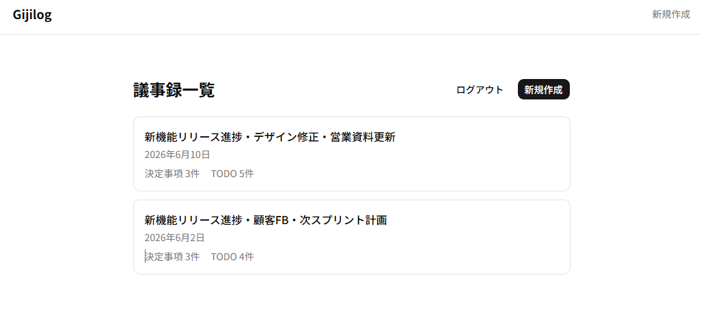

# Gijilog

> AIが議事録を自動で整理するWebアプリ

会議のテキストを貼り付けるだけで、Claude AIが決定事項・TODOを自動抽出。編集・保存・PDF出力まで一気通貫で行えます。

🔗 **[デモを試す](https://gijilog-mvp.vercel.app)**（デプロイ後にURLを更新してください）



---

## 主な機能

- **AI自動抽出** — 会議テキストから決定事項・TODO・担当者・期日をClaude APIで抽出
- **編集・保存** — 抽出結果を確認・修正してDBに保存
- **PDF出力** — 日本語対応のPDFをワンクリックでダウンロード
- **認証** — Supabase Authによるメール認証

---

## 技術スタック

| カテゴリ | 技術 |
|---|---|
| フロントエンド | Next.js 15 (App Router) / TypeScript / Tailwind CSS / shadcn/ui |
| バックエンド | Next.js Server Actions / API Routes |
| DB | Supabase (PostgreSQL) / Prisma v6 |
| 認証 | Supabase Auth (`@supabase/ssr`) |
| AI | Anthropic Claude API (Tool use) |
| PDF | @react-pdf/renderer |
| デプロイ | Vercel |

---

## アーキテクチャの特徴

- **Server Actions** によるフォーム送信（APIエンドポイント不要）
- **Claude Tool use** で構造化JSONを確実に取得（`forced tool_choice`）
- **Prisma + Supabase** の組み合わせでRLSをバイパスしつつ、Server Actions内で`userId`スコープのWHERE句によりデータアクセスを制御
- **defense-in-depth**：ミドルウェア認証チェック + Prismaクエリレベルのスコープ検証の2層構造

---

## ローカル環境での起動

```bash
# 依存関係のインストール
npm install

# 環境変数の設定
cp .env.example .env.local
# .env.local に各種キーを設定

# DBマイグレーション
npx prisma migrate dev

# 開発サーバー起動
npm run dev
```

### 必要な環境変数

```
NEXT_PUBLIC_SUPABASE_URL=
NEXT_PUBLIC_SUPABASE_PUBLISHABLE_KEY=
SUPABASE_SERVICE_ROLE_KEY=
DATABASE_URL=
DIRECT_URL=
ANTHROPIC_API_KEY=
```

---

## 開発の背景

AI駆動の受託開発会社向けポートフォリオとして開発。「AIを活用した業務効率化ツール」を自ら設計・実装し、受託開発で求められる以下の観点を実践しました。

- MVP優先・過剰設計の回避
- セキュリティを意識したデータアクセス設計
- 保守しやすいコード構成とアーキテクチャ記録（`ARCHITECTURE_DECISIONS.md`）